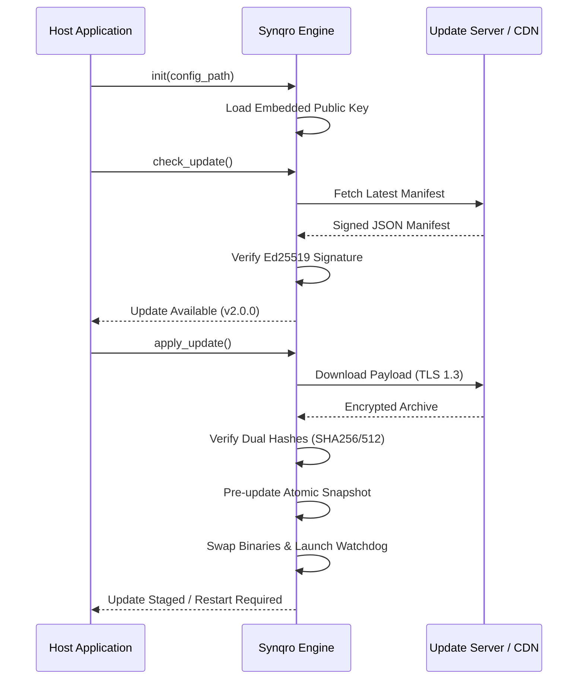

# SYNQRO
### The Zero-Trust Over-the-Air (OTA) Update Engine

**Synqro** is a high-integrity, multi-platform software delivery engine designed to solve the fundamental trust problem in remote software updates. Built in **Rust** for maximum safety and performance, Synqro provides a cryptographically verified pipeline that treats the entire delivery network—from CDNs to local storage—as untrusted.

---

## 🏗️ Architecture & Philosophy

Traditional update mechanisms often rely on the security of the transport layer (TLS) or the integrity of the distribution server. Synqro operates on a **Zero-Trust** model: every update bundle must prove its own integrity through a multi-layered cryptographic handshake before a single byte is executed on the host system.

### Core Security Principles

| Feature | Technical Implementation | Security Benefit |
| :--- | :--- | :--- |
| **End-to-End Verification** | Ed25519 Digital Signatures | Protects against CDN compromise and man-in-the-middle attacks. |
| **Dual-Hash Integrity** | Parallel SHA-256 & SHA-512 | Eliminates collision risks and ensures bit-perfect payload delivery. |
| **Atomic Restoration** | Watchdog-monitored Atomic Swaps | Prevents "bricking" by ensuring a clean rollback if the update fails to boot. |
| **Platform Isolation** | Native OS Keychain Integration | Securely stores installation identifiers and cryptographic metadata. |

---

## 🔄 The Synqro Lifecycle

The following diagram illustrates the secure handshake between the host application, the Synqro engine, and the external update infrastructure:



---

## 📦 Multi-Language Integration

Synqro is designed as a drop-in core with native bindings for the most popular application environments.

### Rust (Native)
Add the following to your `Cargo.toml`:
```toml
[dependencies]
synqro = "0.1.0"
```

### Dart & Flutter
Add the following to your `pubspec.yaml`:
```yaml
dependencies:
  synqro: ^0.1.0
```

### Python
Install the SDK via pip:
```bash
pip install synqro
```

---

## 🛠️ Implementation Examples

### Basic Initialization (Rust)
```rust
use synqro::{SynqroClient, SynqroResult};
use std::path::Path;

fn main() -> Result<(), Box<dyn std::error::Error>> {
    let mut client = SynqroClient::new();
    
    // Initialize with a secure configuration
    client.init(Path::new("synqro_ota.yaml"))?;
    
    // Check and apply updates in a single workflow
    if client.check_update()? {
        println!("New release detected. Proceeding with atomic update...");
        client.apply_update()?;
        println!("Update applied successfully. Please restart.");
    }
    
    Ok(())
}
```

### Advanced Usage with Audit Logging (Dart)
```dart
import 'package:synqro/synqro.dart';

Future<void> runSecureUpdate() async {
  final updater = SynqroClient.load();
  
  try {
    final initResult = updater.init('config/ota_settings.yaml');
    if (!initResult.isOk) throw SynqroException(initResult);

    if (updater.checkUpdate()) {
      // Log custom event to the secure audit trail
      updater.logAuditEvent('update_start', {'version': '2.0.1'});
      
      updater.applyUpdate();
    }
  } catch (e) {
    print('Update failed: $e');
    updater.rollback(); // Manually trigger rollback if needed
  } finally {
    updater.dispose();
  }
}
```

---

## 🚀 Strategic Roadmap for Improvement

To elevate Synqro from a library to a world-class security standard, we recommend the following technical enhancements:

1.  **Differential Updates (Delta Compression)**: Implement binary diffing (using algorithms like Zstandard or Courgette) to reduce update sizes by up to 90%, saving bandwidth and improving user experience on slow connections.
2.  **Hardware Security Module (HSM) Support**: Extend the keychain integration to support hardware-backed keys (TPM on Windows, Secure Enclave on iOS/macOS) for the highest level of cryptographic isolation.
3.  **Wasm-based Sandbox Execution**: Introduce an optional sandbox for update post-processing scripts using WebAssembly, ensuring that even verified updates cannot perform unauthorized system actions.
4.  **Decentralized Manifests**: Support IPFS or BitTorrent as alternative distribution layers to eliminate the central server as a single point of failure.

---

## 📄 License & Creator

Synqro is dual-licensed under the **MIT** and **Apache 2.0** licenses, providing maximum flexibility for both open-source and commercial applications.

**Designed, Architected, and Maintained by Farhang Fatih.**
