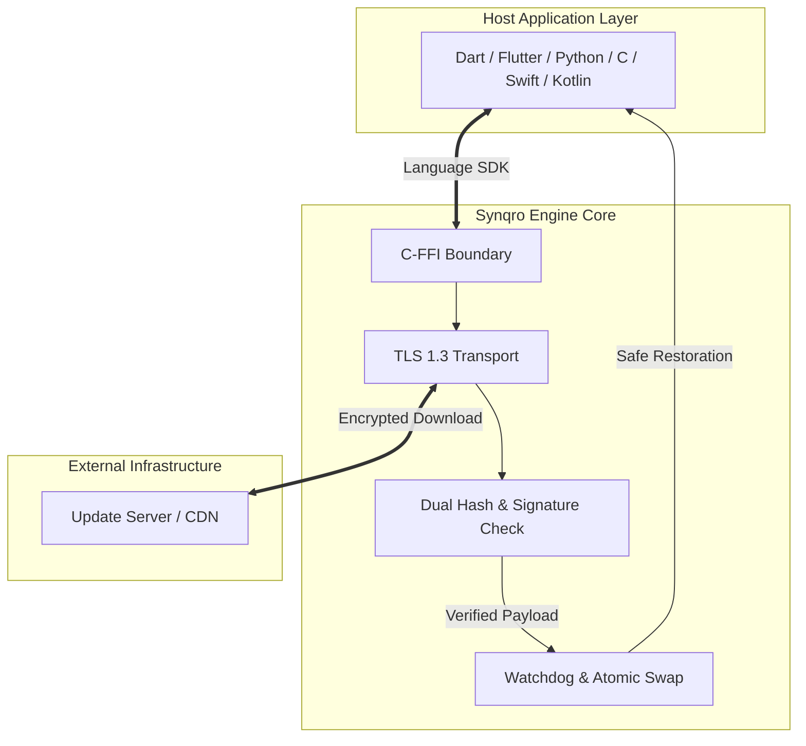

<div align="center">

# SYNQRO

**Cryptographically Verified Over-the-Air Update Engine**

[](https://github.com/MrGuevar4/synqro)

<p align="center">
  <a href="https://github.com/MrGuevar4/synqro/actions"></a>
  <a href="./SECURITY.md"></a>
  <a href="./LICENSE"></a>
</p>

Created and architected by **Farhang Fatih**

</div>

---

## Overview

Synqro is a zero-trust over-the-air (OTA) software update engine built in Rust. It provides software developers with a drop-in library to securely distribute updates across Linux, macOS, Windows, Android, and iOS.

Unlike traditional update tools that rely implicitly on transport security or external package managers, Synqro treats the network, CDN, and storage layers as untrusted. Every update bundle must be signed against an Ed25519 public key embedded inside the compiled application binary. If a downloaded payload has been modified, tampered with, or replayed from an expired release, Synqro rejects it before execution.



---

## Adding Synqro to Your Project

You can integrate Synqro into existing codebases across multiple languages using native bindings or standard package managers.

### Python Projects

Install the official Python package using pip:

```bash
pip install synqro
```

To manage dependencies with poetry or hatch, add it directly to your configuration:

```toml
[dependencies]
synqro = "^0.1.0"
```

### Dart and Flutter Applications

Add Synqro to your `pubspec.yaml` file under dependencies:

```yaml
dependencies:
  synqro:
    git:
      url: https://github.com/MrGuevar4/synqro.git
      path: ffi/dart
```

Run `dart pub get` or `flutter pub get` to fetch the binding package.

### Rust Projects

Add Synqro to your `Cargo.toml` manifest:

```toml
[dependencies]
synqro = { git = "https://github.com/MrGuevar4/synqro.git", branch = "main" }
```

### C and C++ Applications

Download the public C header and link against the compiled dynamic or static library:

```bash
# Download the public header
curl -fsSL https://raw.githubusercontent.com/MrGuevar4/synqro/main/ffi/synqro.h -o include/synqro.h
```

Include `synqro.h` in your source files and pass `-lsynqro` to your linker during compilation.

---

## End-to-End Implementation Guide

Integrating over-the-air updates requires four basic steps: configuring cryptographic keys, setting up the client configuration, connecting the SDK in your code, and publishing releases.

### Step 1: Generate Release Keys

Before releasing updates, generate an Ed25519 key pair. Keep your private key secure in your CI/CD pipeline or hardware security module, and embed the public key inside your application configuration.

```bash
# Generate private signing key
openssl genpkey -algorithm Ed25519 -out synqro_private.pem

# Extract public verification key
openssl pkey -in synqro_private.pem -pubout -out synqro_public.pem
```

### Step 2: Create the Client Configuration

Create a file named `synqro_ota.yaml` inside your application working directory or root config path. This tells the Synqro engine where to check for updates and how to handle storage.

```yaml
# synqro_ota.yaml
manifest_url: "https://updates.yourdomain.com/releases/latest.json"
channel: "stable"
cache_dir: ".synqro_cache"
log_level: "info"
max_download_bytes: 104857600  # 100 MiB limit
connect_timeout_secs: 30
request_timeout_secs: 300
require_restart: true
```

### Step 3: Integrate the SDK into Your Code

Call the initialization routine when your application boots, check for pending updates, and apply them when ready.

#### Python Example

```python
from pathlib import Path
from synqro import SynqroClient, SynqroException

def manage_updates():
    client = SynqroClient()
    
    try:
        # Initialize the update engine
        client.init(Path("synqro_ota.yaml"))
        
        # Check remote manifest for newer versions
        if client.check_update():
            print("New software release detected. Downloading payload...")
            
            # Download, verify signatures, and swap files atomically
            client.apply_update()
            print("Update successfully staged. Please restart the application.")
        else:
            print("Application is currently up to date.")
            
    except SynqroException as error:
        print(f"Update process terminated: {error}")
        # The internal watchdog retains the existing healthy version automatically

if __name__ == "__main__":
    manage_updates()
```

#### Dart and Flutter Example

```dart
import 'package:synqro/synqro.dart';

Future<void> checkAndApplyUpdates() async {
  final updater = SynqroClient();
  
  try {
    updater.init('synqro_ota.yaml');
    
    final updateAvailable = updater.checkUpdate();
    if (updateAvailable) {
      print('Downloading verified update...');
      updater.applyUpdate();
      print('Update applied. Restart required.');
    }
  } catch (error) {
    print('Failed to perform update: $error');
  }
}
```

#### C Example

```c
#include "synqro.h"
#include <stdio.h>

int main() {
    SynqroResult* res = synqro_init("synqro_ota.yaml");
    if (res->status != SYNQRO_OK) {
        fprintf(stderr, "Initialization failure: %s\n", res->message);
        synqro_free_result(res);
        return 1;
    }
    synqro_free_result(res);

    res = synqro_check_update();
    if (res->status == SYNQRO_OK) {
        printf("Applying available update...\n");
        synqro_free_result(res);
        
        res = synqro_apply_update();
        if (res->status == SYNQRO_OK) {
            printf("Update installed successfully.\n");
        } else {
            fprintf(stderr, "Installation failed: %s\n", res->message);
            synqro_rollback();
        }
    }
    
    synqro_free_result(res);
    return 0;
}
```

### Step 4: Publish Signed Releases

When distributing a new update, calculate the dual checksums and generate a cryptographic signature using your Ed25519 private key.

```bash
# Calculate checksums
sha256sum app_v2.0.0.tar.gz > app_v2.0.0.sha256
sha512sum app_v2.0.0.tar.gz > app_v2.0.0.sha512

# Sign the binary
openssl pkeyutl -sign -inkey synqro_private.pem -rawin -in app_v2.0.0.tar.gz | base64 > app_v2.0.0.sig
```

Host your release bundle alongside a release manifest (`latest.json`) on any HTTPS server or static object storage bucket:

```json
{
  "version": "2.0.0",
  "issued_at": "2026-06-28T16:00:00Z",
  "artifact_url": "https://updates.yourdomain.com/releases/app_v2.0.0.tar.gz",
  "sha256": "e3b0c44298fc1c149afbf4c8996fb92427ae41e4649b934ca495991b7852b855",
  "sha512": "cf83e1357eefb8bdf1542850d66d8007d620e4050b5715dc83f4a921d36ce9ce47d0d13c5d85f2b0ff8318d2877eec2f63b931bd47417a81a538327af927da3e",
  "signature": "MC4CFQCN...base64_signature...=="
}
```

---

## How Rollback and Recovery Works

Deploying updates to remote devices carries the risk of introducing crash loops or unbootable states. Synqro mitigates this through automated recovery mechanics:

1. **Pre-Update Snapshot:** Before modifying application files, Synqro captures the existing system state and calculates an HMAC signature over the backup directory.
2. **Watchdog Monitoring:** When an update is installed, an independent watchdog process is spawned. If the application crashes during startup or fails to call `synqro_health_check()` within a defined grace period, the watchdog intervenes.
3. **Atomic File Restoration:** The watchdog verifies the backup HMAC signature to ensure local backups remain uncorrupted, then performs an atomic filesystem swap to restore the previous working binary.
4. **Manifest Blacklisting:** To prevent devices from continuously downloading a broken release, Synqro records the failed manifest version in an encrypted local blacklist.

---

## Platform Compatibility

Synqro compiles natively with zero runtime runtime dependencies across all target operating systems.

| Operating System | Architecture | Shared Library | Static Library |
| :--- | :--- | :--- | :--- |
| **Linux** | `x86_64`, `aarch64` | `libsynqro.so` | `libsynqro.a` |
| **macOS** | Apple Silicon, Intel | `libsynqro.dylib` | `libsynqro.a` |
| **Windows** | `x86_64` | `synqro.dll` | `synqro.lib` |
| **Android** | `arm64-v8a`, `armeabi-v7a` | `libsynqro.so` | N/A |
| **iOS** | `arm64` | N/A | `libsynqro.a` |

---

## Creator and License

Designed, created, and maintained by **Farhang Fatih**.

This software is dual-licensed under either the [MIT License](./LICENSE) or Apache License 2.0, at your option.
