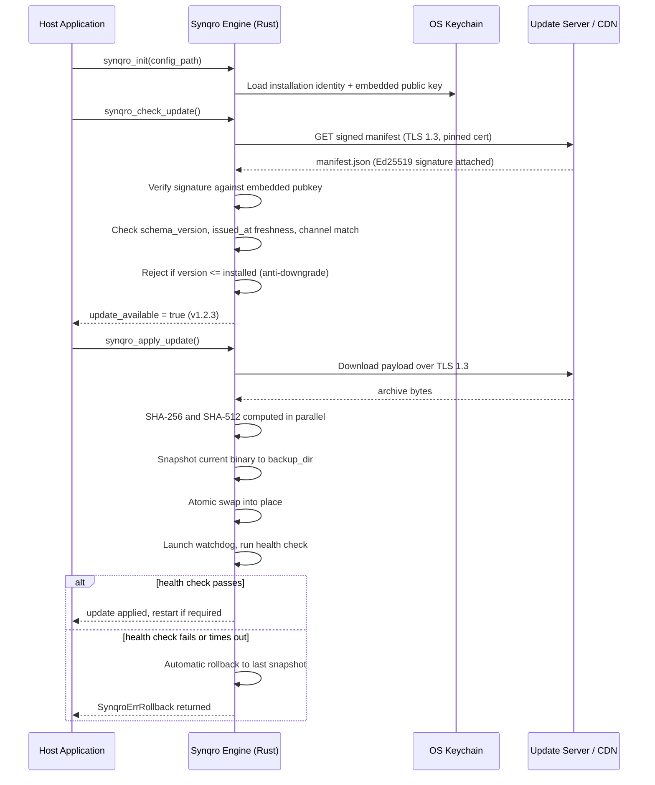

<div align="center">


<a href="https://github.com/MrGuevar4/synqro/blob/main/LICENSE"></a>


<br/>


<br/><br/>


</div>

<br/>

<p align="center">
  <i>A Rust engine that treats the entire software delivery path — CDN, network, disk — as hostile, and proves every byte before it touches your application.</i>
</p>

<p align="center">
  <a href="#why-this-exists">Why This Exists</a> ·
  <a href="#how-it-works">How It Works</a> ·
  <a href="#installing-synqro">Installing</a> ·
  <a href="#configuration">Configuration</a> ·
  <a href="#usage-examples">Usage Examples</a> ·
  <a href="#project-layout">Project Layout</a> ·
  <a href="#supply-chain--ci">Supply Chain &amp; CI</a> ·
  <a href="#what-i-learned-building-this">What I Learned</a> ·
  <a href="#roadmap">Roadmap</a> ·
  <a href="#license">License</a>
</p>

---

## Why This Exists

Most apps that update themselves over the network are trusting three things they shouldn't: the CDN that hosts the binary, the TLS handshake that delivered it, and the assumption that "it downloaded successfully" means "it's safe to run." That chain has broken before, in public, more than once — compromised build servers pushing trojanized installers, hijacked update channels, and CDNs serving tampered packages while every certificate involved looked completely valid.

Synqro starts from the opposite assumption: **nothing in the delivery path is trusted, ever, including the transport layer.** A TLS connection only proves you're talking to *a* server — it says nothing about whether the bytes coming down that pipe are the bytes your team actually built and signed. So instead of stopping at "the connection is encrypted," Synqro requires every manifest and every payload to carry its own proof of origin and integrity, independent of the network that delivered it. If that proof doesn't check out, nothing gets written to disk, let alone executed.

This repository is the engine that enforces that rule. It's written in Rust because an updater is one of the few pieces of software where a memory-safety bug or an unhandled panic isn't just a crash — it's a window for an attacker to replace your application with something else entirely.

---

## How It Works

The trust model is simple to state and deliberately hard to bypass: **a manifest only matters once it's verified, and a payload only matters once the manifest says it should exist.**



A few details in that flow are worth calling out, because they're the parts that actually do the security work:

- **The manifest is the only thing that's ever trusted, and only after verification.** Everything downstream — what to download, which hash it should have, which version it claims to be — comes from a JSON document that's rejected outright if its Ed25519 signature doesn't match the public key embedded in the binary at build time.
- **Anti-replay and anti-downgrade are enforced before a single byte of the payload is fetched.** A manifest older than 24 hours is refused. A manifest claiming a version lower than what's installed is refused unless rollback was explicitly requested. Both checks exist because an attacker doesn't need to forge a new manifest if they can just replay an old, validly-signed one.
- **The watchdog is what makes rollback actually atomic.** A binary swap that "succeeds" but produces an app that can't boot is functionally the same as a failed update — Synqro treats it that way by running a configurable health check immediately after the swap and reverting automatically if it doesn't pass within `health_check_timeout_seconds`.
- **Secrets never touch the filesystem.** Installation identifiers, signing-related metadata, and API tokens are read exclusively from the platform's native secret store — Keychain Services on macOS, DPAPI/WinCred on Windows, Secret Service on Linux, the Android Keystore, and the iOS Keychain — never from a config file or environment dump that could be picked up by an unrelated process.

---

## Core Security Properties

| Property | Implementation | What it actually defends against |
| :-- | :-- | :-- |
| End-to-end manifest authenticity | Ed25519 signatures, public key embedded at compile time | A compromised CDN or man-in-the-middle serving a tampered manifest |
| Payload integrity | SHA-256 and SHA-512 computed independently and compared | Hash-collision attacks and silent transport corruption |
| Anti-replay | `issued_at` freshness window (24h) on every manifest | An attacker replaying an old, validly-signed manifest |
| Anti-downgrade | SemVer comparison against the installed version | Forcing a device back onto a version with a known vulnerability |
| Atomic install | Snapshot-then-swap with a watchdog health check | A partially-applied update bricking the host application |
| Automatic self-heal | Rollback triggered on health-check failure or timeout | An update that "succeeds" but produces a broken binary |
| Secret isolation | Native OS keychain on every supported platform | Credential theft via filesystem access or process memory dumps |
| Transport hardening | `rustls` only, TLS 1.3 minimum, optional certificate pinning | Downgrade attacks and CA-compromise scenarios |
| Tamper-evident audit trail | Append-only JSONL log, optionally HMAC-signed per line | Silent post-hoc edits to the update history |
| Memory safety at the FFI boundary | `#![forbid(unsafe_code)]` everywhere except the FFI shim, with panics caught before crossing into C | Undefined behavior propagating out of the Rust core into host applications |

---

## Installing Synqro

Synqro ships a single Rust core (`libsynqro`) compiled as a `cdylib`/`staticlib`/`rlib`, with thin, idiomatic bindings on top for every major application runtime.

<table>
<tr><td><b>Rust</b></td><td>

```toml
[dependencies]
synqro = "0.1.0"
```

</td></tr>
<tr><td><b>Python (3.10+)</b></td><td>

```bash
pip install synqro
```

The Python package is a pure `ctypes` wrapper around the compiled shared library — no third-party dependencies, no `pip` packages pulled in transitively just to call across the FFI boundary.

</td></tr>
<tr><td><b>Dart / Flutter</b></td><td>

```yaml
dependencies:
  synqro: ^0.1.0
```

Null-safe Dart 3 bindings via `dart:ffi`, with the correct shared library resolved automatically per platform (`.so`, `.dylib`, `.dll`, or statically linked on iOS).

</td></tr>
<tr><td><b>C / C++ / Swift / Kotlin</b></td><td>

Link against the compiled library and include `ffi/synqro.h` directly. The header exposes a small, deliberately minimal C ABI:

```c
SynqroResult synqro_init(const char* config_path);
SynqroResult synqro_check_update(void);
SynqroResult synqro_apply_update(void);
SynqroResult synqro_rollback(void);
SynqroResult synqro_audit_event(const char* event_type, const char* data_json);
SynqroResult synqro_health_check(void);
const char*  synqro_version(void);
char*        synqro_installation_id(void);
void         synqro_free_string(char* ptr);
void         synqro_free_result(SynqroResult* result);
```

Every heap-allocated value returned across this boundary has a matching `synqro_free_*` function — never free it with your own allocator.

</td></tr>
<tr><td><b>WebAssembly</b></td><td>

```bash
npm install @synqro/wasm
```

Built via `wasm-pack` from the same Rust core, for verifying update manifests inside browser-based or edge/serverless environments where a native binary isn't an option.

</td></tr>
</table>

---

## Configuration

Every Synqro instance is driven by a single YAML file, validated against a strict schema before the engine will start — unknown fields are rejected outright rather than silently ignored, which has caught more than one copy-paste mistake during setup.

```yaml
axiomota:                       # top-level key kept for backward compatibility
  version: "1.0"
  installation_id: "f3a1c2e0-9b4d-4a7e-8c1f-2d6e9a0b5c3d"

  source:
    provider: github
    owner: your-org
    repo: your-app
    branch: release
    manifest_path: releases/manifest.json

  auth:
    token_source: env
    env_var: SYNQRO_GITHUB_TOKEN

  crypto:
    release_signing_pubkey: "BASE64_ED25519_PUBLIC_KEY"
    github_api_cert_pin: "SHA256_HEX_CERT_FINGERPRINT"

  update:
    check_interval_seconds: 3600
    max_retries: 3
    retry_backoff_base_seconds: 5
    download_timeout_seconds: 120
    max_payload_size_bytes: 524288000
    staging_dir: .synqro_cache/staging/
    backup_dir: .synqro_cache/backup/

  rollback:
    enabled: true
    health_check_timeout_seconds: 30
    max_backup_versions: 3

  reporting:
    enabled: true
    telegram_token_source: env
    telegram_token_env_var: SYNQRO_TELEGRAM_TOKEN
    telegram_chat_id: "-1001234567890"
    scrub_patterns:
      - "(?i)password=\\S+"
      - "(?i)token=\\S+"

  logging:
    level: info
    structured: true
    audit_log_path: /var/log/synqro/audit.jsonl
    audit_hmac_enabled: true
```

A few of these fields exist specifically because of mistakes that are easy to make in production:

- `update.check_interval_seconds` has a hard floor of 60 — there's no config path to accidentally hammer your own update server every few seconds.
- `crypto.github_api_cert_pin` pins the TLS certificate used to talk to the manifest source, on top of standard certificate validation, so a compromised CA doesn't silently become a trusted path to your update server.
- `reporting.scrub_patterns` runs against crash reports before they leave the device — regexes for anything that looks like a credential get redacted before the report is ever transmitted.

---

## The Update Manifest

The manifest is the single source of truth the engine trusts, and it's deliberately small. It's signed once at release time and never modified after publishing:

```json
{
  "schema_version": "1",
  "issued_at": "2026-06-28T12:00:00Z",
  "installation_id": "",
  "version": "1.2.3",
  "channel": "stable"
}
```

`schema_version` lets the client refuse a manifest format it doesn't understand instead of guessing. `issued_at` is the anti-replay clock. `installation_id` is left blank for manifests meant to apply universally, or filled in to target a single device or tenant. `channel` keeps canary and beta builds from ever reaching a client configured to track `stable`, even if someone fat-fingers a release into the wrong directory.

---

## Usage Examples

<details open>
<summary><b>Rust</b></summary>

```rust
use synqro::{SynqroClient, SynqroResult};
use std::path::Path;

fn main() -> Result<(), Box<dyn std::error::Error>> {
    let mut client = SynqroClient::new();
    client.init(Path::new("synqro_ota.yaml"))?;

    if client.check_update()? {
        println!("New release detected — verifying and applying...");
        client.apply_update()?;
        println!("Update applied. A restart will load the new version.");
    } else {
        println!("Already on the latest verified release.");
    }

    Ok(())
}
```

</details>

<details>
<summary><b>Python</b></summary>

```python
from synqro import SynqroClient, SynqroException, SynqroStatus

with SynqroClient() as client:
    result = client.init("/etc/myapp/synqro_ota.yaml")
    if result.status != SynqroStatus.OK:
        raise SynqroException(result)

    update = client.check_update()
    print(f"Update check: {update.message}")

    if "update_available" in update.message:
        apply_result = client.apply_update()
        if apply_result.status != SynqroStatus.OK:
            client.rollback()
```

</details>

<details>
<summary><b>Dart / Flutter</b></summary>

```dart
import 'package:synqro/synqro.dart';

Future<void> runSecureUpdate() async {
  final updater = SynqroClient.load();

  try {
    final initResult = updater.init('config/ota_settings.yaml');
    if (!initResult.isOk) throw SynqroException(initResult);

    if (updater.checkUpdate()) {
      updater.logAuditEvent('update_start', {'version': '2.0.1'});
      updater.applyUpdate();
    }
  } catch (e) {
    print('Update failed: $e');
    updater.rollback();
  } finally {
    updater.dispose();
  }
}
```

</details>

<details>
<summary><b>C</b></summary>

```c
#include "synqro.h"
#include <stdio.h>

int main(void) {
    SynqroResult res = synqro_init("synqro_ota.yaml");
    if (res.status != SynqroOk) {
        fprintf(stderr, "init failed: %s\n", res.message);
        return 1;
    }

    res = synqro_check_update();
    if (res.status == SynqroOk) {
        res = synqro_apply_update();
        if (res.status != SynqroOk) {
            synqro_rollback();
        }
    }

    synqro_free_result(&res);
    return 0;
}
```

</details>

---

## Project Layout

```
synqro/
├── src/
│   ├── lib.rs             # Crate root, FFI shim, global engine state
│   ├── config.rs          # YAML schema + validation (axiomota: top-level key)
│   ├── downloader.rs      # TLS 1.3 transport, cert pinning, dual-hash verification
│   ├── audit.rs           # Tamper-evident, HMAC-signable JSONL audit logger
│   ├── rollback.rs        # Snapshot, watchdog, atomic swap, self-heal logic
│   ├── error.rs           # Structured errors + C-ABI result types
│   └── keychain/          # One module per platform secret store
│       ├── macos.rs       # Keychain Services
│       ├── windows.rs     # DPAPI / WinCred
│       ├── linux.rs       # Secret Service
│       ├── android.rs     # Android Keystore
│       └── ios.rs         # iOS Keychain
├── ffi/
│   ├── synqro.h            # C ABI header (C, C++, Swift, Kotlin)
│   ├── python/synqro.py    # ctypes binding
│   └── dart/lib/synqro.dart  # dart:ffi binding
├── synqro/                 # Python package (SynqroClient wrapper + reporter)
│   └── reporter/
│       └── telegram_bot.py # Standalone crash-report delivery script
├── wasm/                   # wasm-pack build target for browser/edge use
├── scripts/
│   ├── build-android.sh
│   ├── build-wasm.sh
│   ├── sign-artifact.sh    # Release signing, key held in RAM-backed tmpfs only
│   └── post_install.py
├── SECURITY.md             # Threat model, disclosure policy, ASVS mapping
├── CI_PIPELINE.md          # Full CI/CD specification
├── PUBLISHING_GUIDE.md     # Multi-platform release process
└── STRATEGIC_ROADMAP.md    # Long-term technical direction
```

---

## Crash & Event Reporting

When something goes wrong in the field, `synqro/reporter/telegram_bot.py` is invoked by the engine as a standalone process — it is never imported as a library, and it loads its bot token exclusively from the OS keychain or an environment variable, never from a file on disk. Reports are HMAC-signed before delivery and rate-limited on the receiving end, so a crash loop on one device can't be used to flood the reporting channel. It's a deliberately small, single-purpose script rather than a general telemetry SDK, which keeps the attack surface of "the thing that runs after a crash" as small as possible.

---

## Supply Chain & CI

A signing key is only as good as the pipeline that uses it, so the project treats its own build and release process with the same suspicion it applies to update payloads:

- **Dependency pinning.** Every dependency in `Cargo.toml` is pinned to an exact version (`=x.y.z`), not a range — a transitive dependency update can't silently change behavior between two builds of the same tag.
- **Hardened release profile.** `lto = "fat"`, `codegen-units = 1`, `panic = "abort"`, `overflow-checks = true`, and stripped symbols — the release binary is built to fail loudly on an integer overflow rather than continue in an undefined state.
- **Automated vulnerability scanning.** `cargo-audit` and `cargo-deny` run on every pull request and block merges on known advisories, disallowed licenses, or flagged supply-chain issues (`deny.toml` defines the rule set).
- **Static analysis.** Clippy on the Rust core, Bandit on the Python SDK.
- **Reproducible builds.** Release artifacts are independently verified to be bit-for-bit reproducible across Linux (x86_64, aarch64), macOS (x86_64, arm64), and Windows (x86_64).
- **Signed releases with provenance.** Artifacts are signed with the project's Ed25519 release key — generated in a RAM-backed temp directory and never written to disk — and shipped with a CycloneDX SBOM and SLSA provenance attestation alongside the binary.
- **Distribution.** Releases publish to crates.io, PyPI, pub.dev, and GitHub Releases through a tag-triggered pipeline, with `ci.yml` running the full test and audit suite first and `release.yml` handling signing and publishing only after every check passes.

The full specification for both workflows, including the exact signing script, lives in `CI_PIPELINE.md`.

---

## Compliance Mapping

Synqro's security controls are organized against established frameworks rather than an ad-hoc checklist, which makes it easier to answer "does this satisfy our security review" with something more concrete than "yes, trust us":

- **OWASP ASVS Level 3** — architecture and threat modeling, cryptographic storage, communications security, and error handling controls are each mapped individually in `SECURITY.md`.
- **NIST SP 800-193** (Platform Firmware Resiliency) — the detect-and-recover model that section describes is essentially what the rollback/watchdog system implements at the application layer.
- **FIPS 140-3** — algorithm selection (SHA-2 family, no legacy hash functions) follows FIPS-approved primitives, though the crate itself is not a certified module.

---

## What I Learned Building This

A few things became obvious only after the design was already committed to:

**Pinning every dependency exactly is annoying right up until it isn't.** Early on it felt like unnecessary friction — every `cargo update` required deliberately bumping versions one at a time. Then a transitive crate shipped a breaking behavior change in a patch release, and the pinned `Cargo.toml` was the only reason it didn't reach a tagged release silently.

**The FFI boundary is where most of the real risk lives, not the cryptography.** Ed25519 and SHA-2 are well-understood and hard to get wrong if you use a maintained crate. What's genuinely easy to get wrong is a null pointer crossing into C, or a panic unwinding across an `extern "C"` function, which is undefined behavior in Rust. Wrapping every FFI entry point in `catch_unwind` and null-checking every pointer before dereferencing it ended up being more work than the cryptographic core itself.

**"Atomic" rollback requires a definition of "healthy," and that definition is application-specific.** The engine can swap a binary atomically, but it has no way of knowing on its own whether the new version actually works — that's why the health check is a configurable command rather than a hardcoded heuristic. Without that, "rollback" really meant "rollback if the process literally fails to start," which misses most real-world breakage.

**A signed manifest without an expiry is just a delayed replay attack.** The 24-hour freshness window on `issued_at` wasn't in the original design — it was added after realizing a perfectly valid, properly signed manifest from months earlier could still be served by an attacker who'd gained write access to an old CDN cache, and the signature alone wouldn't catch it.

These are also, not coincidentally, the things most worth reviewing if you're integrating Synqro into a system with its own compliance requirements — they're the assumptions baked into the design, not just implementation details.

---

## Roadmap

The direction from here, in rough priority order, is laid out in full in `STRATEGIC_ROADMAP.md`. The short version:

1. **Delta updates.** Full-payload downloads are wasteful for incremental releases. Binary diffing (`zstd` or a `bsdiff`-style algorithm) is the highest-impact change left for bandwidth and update speed on slow connections.
2. **Parallel hash verification.** SHA-256 and SHA-512 currently run sequentially in places where they could run on separate threads via `rayon`, cutting verification latency on multi-core hosts.
3. **Hardware-backed key storage.** Extending the keychain abstraction to use the TPM on Windows and the Secure Enclave on Apple platforms, so installation identifiers and signing-related metadata are protected even against an attacker with root access.
4. **Post-quantum signatures.** An optional secondary signature layer (Dilithium or SPHINCS+) alongside Ed25519, ahead of any near-term need but cheap to design in now rather than retrofit later.
5. **A unified CLI.** Key generation, manifest signing, and artifact packaging are currently manual steps spread across scripts — a `synqro-cli` would fold them into one tool and remove a meaningful source of human error during releases.
6. **Decentralized manifest distribution.** Optional IPFS or BitTorrent support so a compromised or unavailable central server isn't a single point of failure for the entire update channel.

---

## Contributing

Code ownership for each module is defined in `CODEOWNERS`. Before opening a pull request that touches `src/`, it's worth reading `SECURITY.md`'s threat model section — a change that looks like a small refactor in the downloader or rollback module can quietly remove a guarantee the rest of the system depends on. Vulnerability reports should go through the disclosure process in `SECURITY.md`, not a public issue.

---

## License

Synqro is dual-licensed under **MIT** and **Apache 2.0** — pick whichever fits your project.

Designed, architected, and maintained by **Farhang Fatih**.

<br/>

<div align="center">

</div>
