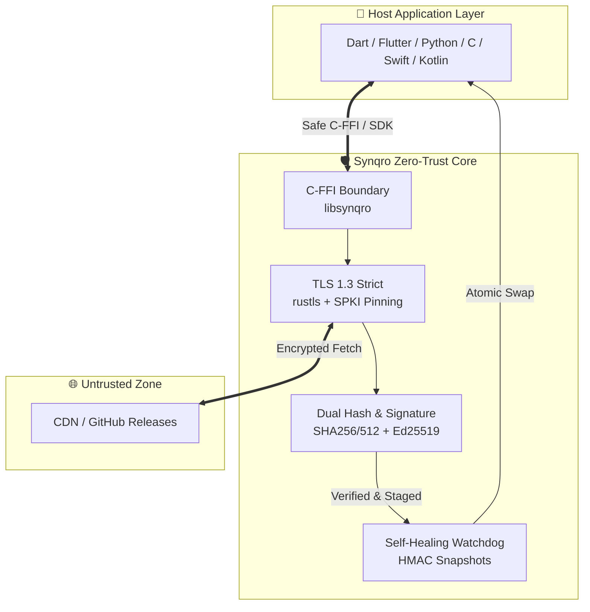

<div align="center">

# ⚡ SYNQRO

**Zero-Trust Over-the-Air (OTA) Updater & Cryptographic Verification Engine**

[](https://git.io/typing-svg)

<p align="center">
  <a href="https://github.com/MrGuevar4/synqro/actions"></a>
  <a href="./SECURITY.md"></a>
  <a href="./LICENSE"></a>
  <a href="https://github.com/MrGuevar4/synqro"></a>
</p>

---

### Created & Architected by **Farhang Fatih**

</div>

---

## 🌟 Why Synqro?

Traditional OTA updaters rely heavily on implicit network trust, fragile CDN certificates, or unverified script executions. **Synqro** revolutionizes software updates by enforcing a **zero-trust cryptographic verification chain** natively within a memory-safe Rust core.



---

## ✨ Key Features & UI/UX Highlights

<details open>
<summary><b>🔒 Cryptographic Fortress (Zero-Trust)</b></summary>
<br/>

- **Ed25519 Hardcoded Root:** Public keys are compiled directly into the binary—eliminating Trust-on-First-Use (TOFU) vulnerability.
- **Dual Hashing Verification:** Every payload is verified against both `SHA-256` and `SHA-512` digests before extraction.
- **SPKI Certificate Pinning:** Protects against compromised Certificate Authorities by verifying leaf server public key hashes.
</details>

<details open>
<summary><b>🚀 Self-Healing & Rollback Protection</b></summary>
<br/>

- **HMAC Tamper-Evident Snapshots:** Creates cryptographically sealed backups prior to any installation.
- **Cross-Process Watchdog:** Monitors application liveness after updates. If an update crashes during boot, the watchdog automatically restores the previous healthy snapshot.
- **Automatic Blacklisting:** Prevents infinite crash loops by blacklisting unstable update manifests.
</details>

<details open>
<summary><b>🌍 Universal Platform Support</b></summary>
<br/>

| Platform | Architecture | Binary / Binding | Status |
| :--- | :--- | :--- | :---: |
| 🐧 **Linux** | `x86_64` / `aarch64` | `libsynqro.so` | 🟢 **Production** |
| 🍏 **macOS** | Apple Silicon & Intel | `libsynqro.dylib` | 🟢 **Production** |
| 🪟 **Windows** | `x86_64` | `synqro.dll` | 🟢 **Production** |
| 🤖 **Android** | `arm64-v8a` / `armeabi-v7a` | `libsynqro.so` (JNI) | 🟢 **Production** |
| 📱 **iOS** | `arm64` | `libsynqro.a` | 🟢 **Production** |

</details>

---

## 🛠️ Comprehensive Installation Guide

### 1️⃣ Installing the SDK

#### **Python SDK**
Install directly via pip or from source:
```bash
pip install synqro
```

#### **Dart / Flutter SDK**
Add to your `pubspec.yaml`:
```yaml
dependencies:
  synqro:
    git:
      url: https://github.com/MrGuevar4/synqro.git
      path: ffi/dart
```

#### **C / C++ Native Engine**
Download the precompiled header and shared library:
```bash
curl -fsSL https://raw.githubusercontent.com/MrGuevar4/synqro/main/ffi/synqro.h -o synqro.h
```

---

## 💻 Developer Guide & Integration Examples

### 🐍 Python Quickstart
```python
from pathlib import Path
from synqro import SynqroClient, SynqroException

# Initialize Synqro Client
client = SynqroClient()

try:
    # 1. Initialize engine with configuration
    client.init(Path("synqro_ota.yaml"))
    
    # 2. Check for available updates
    print("Checking for updates...")
    if client.check_update():
        print("⚡ New version found! Downloading and applying...")
        
        # 3. Apply update atomically with rollback protection
        client.apply_update()
        print("✅ Update applied successfully! Please restart.")
    else:
        print("🟢 System is up to date.")

except SynqroException as e:
    print(f"❌ Update failed: {e}")
    # Automatic rollback is triggered internally by the watchdog
```

### 🎯 Dart / Flutter Quickstart
```dart
import 'package:synqro/synqro.dart';

void main() async {
  final synqro = SynqroClient();
  
  try {
    // Initialize
    synqro.init('synqro_ota.yaml');
    
    // Check update
    if (synqro.checkUpdate()) {
      print('🚀 Update available. Applying update...');
      synqro.applyUpdate();
      print('✅ Update complete.');
    } else {
      print('🟢 App is up to date.');
    }
  } catch (e) {
    print('⚠️ Error during OTA update: $e');
  }
}
```

---

## ⚙️ Configuration File (`synqro_ota.yaml`)

Create a `synqro_ota.yaml` file in your application root directory:

```yaml
# Synqro OTA Configuration
manifest_url: "https://updates.yourdomain.com/synqro_manifest.json"
channel: "stable"
cache_dir: ".synqro_cache"
log_level: "info"
max_download_bytes: 104857600  # 100 MiB limit
connect_timeout_secs: 30
request_timeout_secs: 300
require_restart: true
```

---

## 👨‍💻 Creator & Attribution

<div align="center">

### Designed & Developed by **Farhang Fatih**

[](https://github.com/MrGuevar4)
[](https://github.com/MrGuevar4/synqro)

*Dedicated to pushing the boundaries of autonomous zero-trust systems and secure over-the-air software delivery.*

</div>

---

## 📜 License

This project is dual-licensed under either the [MIT License](./LICENSE) or Apache License 2.0, at your option.
